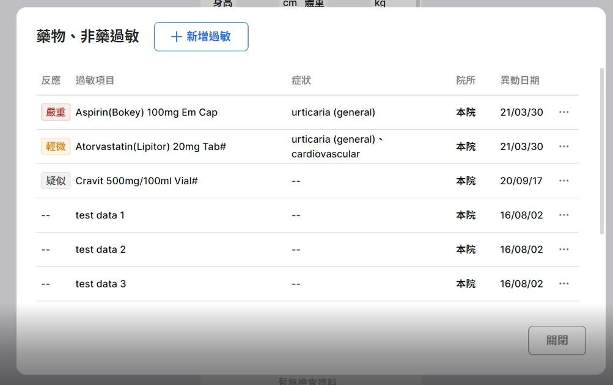

# Interview

## Design a table component

Data structure will be like [fakeAllergyData.js](./src/fakeAllergyData.js)

## Implementation

<https://codesandbox.io/embed/aics-coding-interview-0x5ksp?fontsize=14&hidenavigation=1&theme=dark&view=preview>
