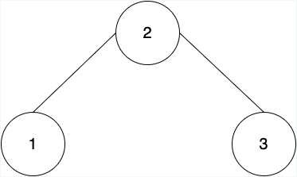
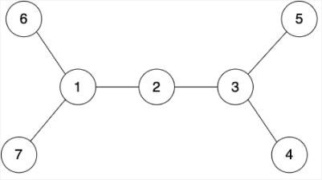
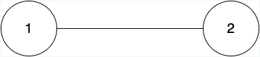

# Special Nodes

Given a tree with N nodes, a node is called special if it is an end-point of any of the diameters of the tree. For all the nodes of the tree, find if it is special or not. Thus, return a binary array, where the $i^{th}$ value of the array will be 1, in case the $i^{th}$ node is special. Else, the $i^{th}$ value of the array will be 0.

Note: The diameter of a tree is defined as the number of edges in the longest path of the tree.

For example, consider the tree given below:



We can see that this tree has only one diameter, which is the unique path between nodes 1 and 3. The length of the diameter is 2.  
The end-points of the diameter are 1 and 3. Hence, nodes 1 and 3 are considered special, while node 2 is not considered a special node of the tree.

## Function Description

Complete the function _isSpecial_ in the editor below.  
`isSpecial` has the following parameter(s):

```txt
tree_nodes: The number of nodes in the tree.
tree_from: The nodes from which the edge is incident onto the other node
tree_to: The nodes on which the edge is incident
```

### Return

`int[n]` an integer array of size N, where the $i^{th}$ value of the array is 1, in case the $i^{th}$ node is special. Else, the $i^{th}$ value will be 0.

### Constraints

- $1 <= tree\_nodes <= 10^5$
- $|tree\_from| = |tree\_to| = tree\_nodes - 1$
- $1 <= tree\_from_i,\ tree\_to_j <= tree\_nodes$

## Sample Case 0

### Sample Input For Custom Testing

```c
STDIN       Function
-----       ---------
7 6      →  N = 7 and N - 1 = 6
1 2      →  edges = [1 2, 2 3, 3 4, 3 5, 1 6, 1 7]
2 3
3 4
3 5
1 6
1 7
```

### Sample Output

```txt
0 0 0 1 1 1 1
```

### Explanation



We have four diameters in this tree, which are the unique paths between the nodes (6,5) (6,4) (7,5) and (7,4). The special nodes are nodes 4,5,6,7 (since they are the end-points of at least one of the diameters of the given tree).

## Sample Case 1

### Sample Input For Custom Testing

```c
STDIN       Function
-----       ---------
2 1      →  N = 2 and N - 1 = 1
2 1      →  edges = [2 1]
```

### Sample Output

```txt
1 1
```

### Explanation



Both the nodes of this tree are special.
